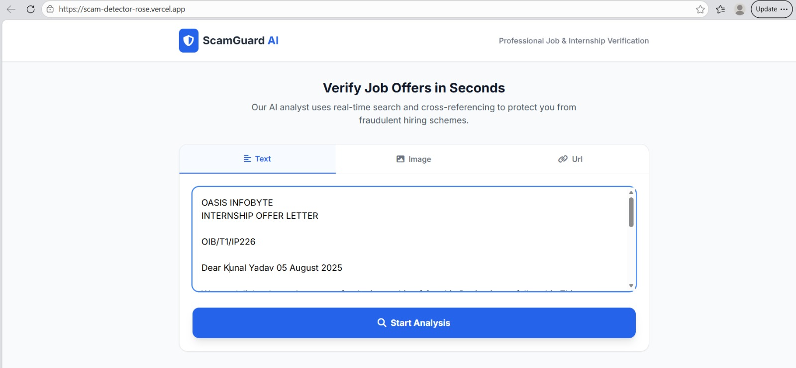
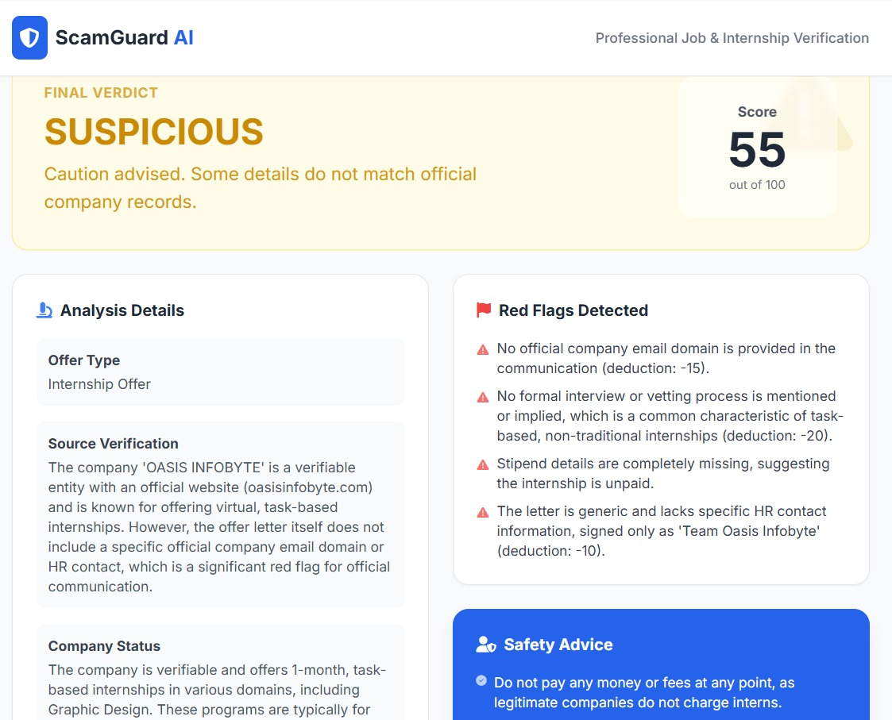
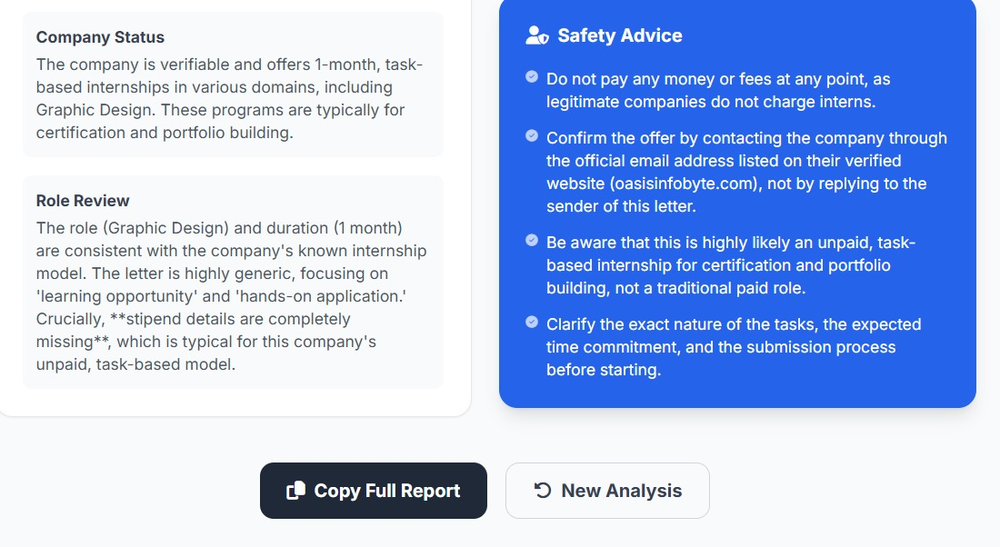

# 🚨 ScamGuard AI  
### AI-Powered Internship & Job Scam Detection System

ScamGuard AI is a **web-based AI application** designed to help students and fresh graduates identify **fake or suspicious internship and job offers** before applying.

It analyzes offer text using **Google Gemini AI** and generates an **explainable credibility score**, helping users avoid scams and make informed career decisions.

---

## 🖼️ Project Preview

### Homepage – Offer Input

### Text Analysis in Action

### Final Verdict & Risk Breakdown

---

## 🔍 Problem Statement

Students frequently receive **fake internship and job offers** through:

- Email  
- WhatsApp  
- Instagram  
- Telegram  

These scams often:
- Ask for **registration or training fees**
- Create urgency (*“limited seats”, “apply immediately”*)
- Use **vague job descriptions** or **unrealistic promises**

### ❌ Impact
- Financial loss  
- Personal data misuse  
- Wasted time and missed genuine opportunities  

Most existing platforms either:
- Focus only on job listings, or  
- Provide a **fake/real result without explanation**

---

## 💡 Solution Overview

**ScamGuard AI** provides a **simple, explainable, AI-driven analysis** of job and internship offers.

Users paste any offer text, and the system:

- Analyzes content using **Google Gemini AI**
- Detects scam-related language patterns
- Generates a **Credibility Score (0–100)**
- Explains *why* an offer is **Safe, Risky, or Scam-like**

> 🎯 Focus: **Prevention & awareness before damage happens**

---

## ⚙️ How It Works

1. User opens the ScamGuard AI web app  
2. Pastes internship or job offer text  
3. Clicks **Start Analysis**  
4. Text is sent to **Google Gemini AI**  
5. AI checks for:
   - Fee requests  
   - Urgency pressure  
   - Vague promises  
   - Missing official details  
6. System generates:
   - Credibility Score  
   - Risk Category  
   - Explainable reasoning  

---

## ✨ Key Features

- 🔍 **AI-Powered Text Analysis (Google Gemini)**
- 📊 **Credibility Score (0–100)**
- 🧠 **Explainable AI Results**
- 🎓 **Student & Internship Focused**
- ⚡ **Fast, No Login Required**
- 🌐 **Platform Independent** (Email, WhatsApp, Telegram, Instagram)

---

## 🧠 Google Technologies Used

### 🔹 Google Gemini API
- Core AI engine
- Natural Language Understanding
- Scam pattern detection
- Explainable reasoning generation

> Authentication, databases, and automation are planned **future enhancements** and are not part of the current MVP.

---

## 🏗️ Architecture Overview

### Components
- **Frontend Web Application** – User input and result display  
- **Google Gemini AI** – Language analysis and reasoning  
- **Risk Evaluation Logic** – Credibility scoring  
- **Result Display Layer** – Clear insights for users  

---

## 🚀 Live Demo (MVP)

- 🌐 **Live Application:**  
  https://scam-detector-rose.vercel.app/

- 🎥 **Demo Video:**  
  https://youtu.be/iPFlYQF5kw4?si=GmqS71jhPZ1OWQG7

- 📄 **Presentation (PPT):**  
  https://drive.google.com/uc?export=download&id=1uIMB9YD3QrR9VOXvrk9tuHoe8GICK6DL

---

## 📂 Repository Information

- **Project Type:** Hackathon MVP  
- **Hackathon:** TechSprint – Leveraging the Power of AI  
- **Problem Statement:** Fake Internship Detection & Prevention  
- **Repository Created:** As per hackathon rules  

---

## 👥 Team Members

- **Akash Lodhi** – Team Leader  
- **Pooja Maurya** – PPT & Video  
- **Priyanshu Kesharwani** – Backend  
- **Sachin Lodhi** – Frontend  

---

## 🔮 Future Enhancements

- User authentication  
- Scan history storage  
- Feedback-based learning  
- Improved risk scoring logic  
- Browser extension support  

---

## ⭐ Why ScamGuard AI?

ScamGuard AI doesn’t just label offers as **fake or real** —  
it explains **why** an offer may be risky.

> *Built for students. Powered by AI. Focused on prevention.*
